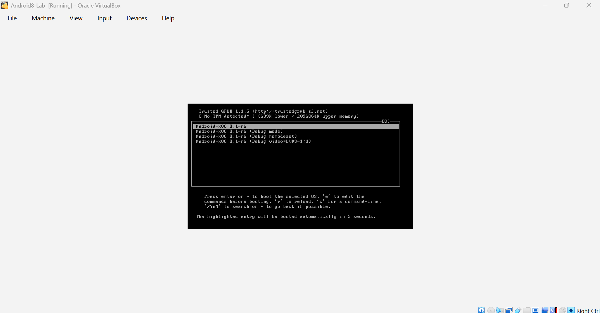
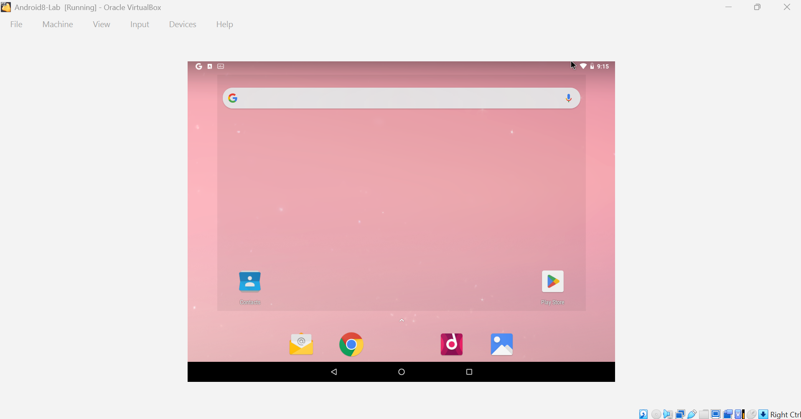
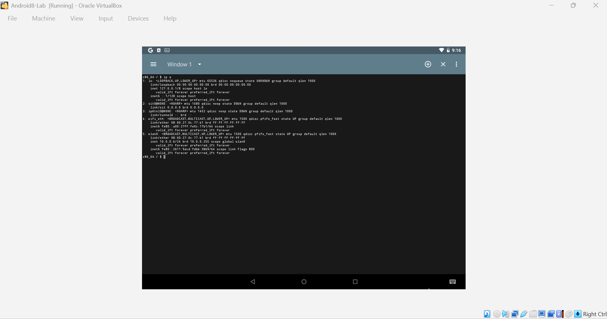
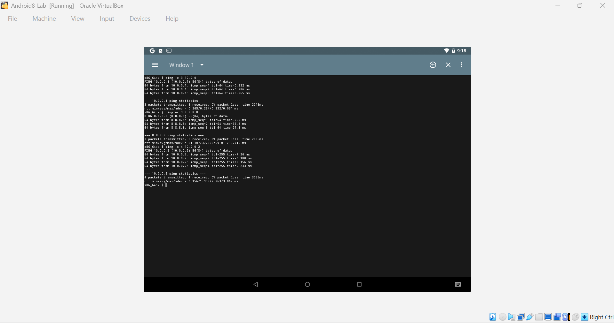
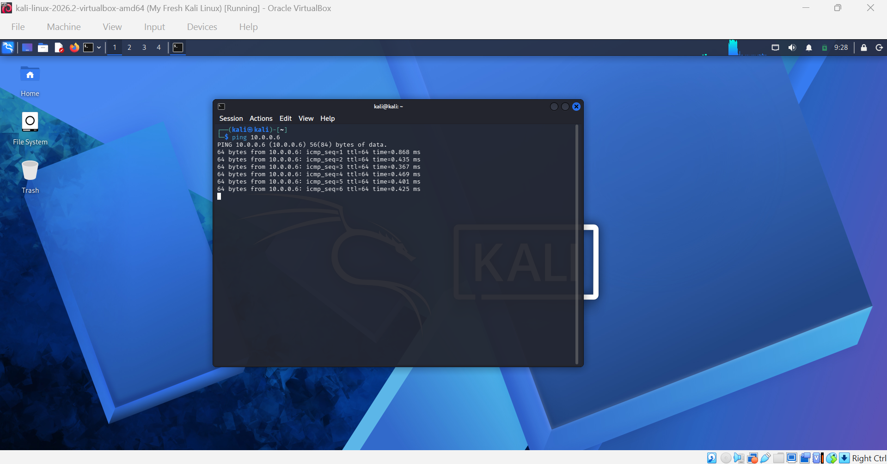

<div align="center">

# 📱 Android Virtual Machine Setup in VirtualBox

**Adding an Android target machine to the cybersecurity lab network**
</div>

<p align="center">
  
  
  
  
  
  
</p>

---

## 📌 Project Overview

This project extends my cybersecurity lab by adding an **Android virtual 
machine** to the same NAT Network already running Kali Linux and Windows 10.

The goal was to create a third machine on the lab network, representing 
a mobile target, and confirm full two-way connectivity between Android, 
Kali Linux, and the internet.

This was the most challenging of the three lab setup projects, involving 
significant troubleshooting around Android-x86 compatibility with 
VirtualBox 7.2 on Windows 11.

---

## 🎯 Objectives

- Download an Android-x86 ISO from the official source
- Create and configure an Android VM in VirtualBox
- Connect Android to the existing NatNetwork (10.0.0.0/24)
- Verify connectivity between Android, Kali Linux, and the internet
- Take a clean snapshot for recovery

---

## ⚙️ Lab Configuration

| 🧩 Component       | ⚙️ Configuration   |
|---------------------|--------------------|
| 🖥️ Host OS          | Windows 11        |
| 🧠 Host RAM         | 16 GB             |
| ⚡ Processor        | Intel Core i7     |
| 🧰 Hypervisor       | VirtualBox 7.2    |
| 🐉 Kali Linux IP    | 10.0.0.2/24       |
| 🪟 Windows 10 IP    | 10.0.0.10/24      |
| 📱 Android IP       | 10.0.0.6/24       |
| 🌐 Virtual Network  | NAT Network       |
| 📡 Network Address  | 10.0.0.0/24       |
| 🚪 Default Gateway  | 10.0.0.1          |
| 🌍 DNS Server       | 8.8.8.8           |

---

## ⚠️ Important Note on Android Version

The initial attempt used Android-x86 9.0. After a full installation 
and extensive troubleshooting, Android 9.0 had an unresolvable network 
driver conflict on Windows 11 with VirtualBox 7.2, the VM would either 
load the GUI without network access, or load the network stack without 
a GUI, depending on the graphics controller used.

After researching the issue, I switched to **Android-x86 8.1-r6** which 
has better VirtualBox network driver support and resolved all issues.

**Download used:** android-x86_64-8.1-r6.iso from the official 
Android-x86 project (SourceForge)

---

## 🪜 Setup Procedure

### Step 1 — Download Android-x86 8.1-r6 ISO

Downloaded from the official Android-x86 project page via SourceForge.
Selected the 64-bit version: android-x86_64-8.1-r6.iso

**Source:** https://www.android-x86.org/download

**Tip:** Always download from the official android-x86.org page or its 
linked SourceForge folder. Avoid third-party mirror sites for 
security reasons.

---

### Step 2 — Create the Android VM in VirtualBox

- Name: Android8-Lab
- Type: Linux, Version: Other Linux (64-bit)
- RAM: 2048 MB
- Storage: 10 GB dynamically allocated VDI

---

### Step 3 — Attach ISO, Configure Display, and Install

Attached the ISO under Settings → Storage.

Display settings:
- Graphics Controller: VMSVGA
- Video Memory: 128 MB
- 3D Acceleration: Disabled

Boot menu → selected **Installation - Install Android-x86 to harddisk**

Partition setup via cfdisk:
- Selected No to GPT — MBR works reliably with VirtualBox
- Created Primary partition using full 10 GB
- Set Bootable flag
- Wrote partition table
- Formatted as ext4
- Installed GRUB bootloader → Yes
- System writable → Yes



---

### Step 4 — Configure NAT Network

- Settings → Network → Adapter 1
- Attached to: NAT Network
- Name: NatNetwork (same as Kali and Windows 10)
- Adapter Type: Intel PRO/1000 MT Desktop
- Cable Connected: ✅

---

### Step 5 — Boot and Verify Network

Android 8.1 booted successfully into the graphical interface.
Opened the built-in Terminal Emulator app.

Android automatically assigned an IP via DHCP on the wlan0 interface:

wlan0: inet 10.0.0.6/24

Attempted to manually assign a static IP address, however the terminal 
emulator in Android 8.1 runs without root privileges and returned:

ifconfig: ioctl 8916: Operation not permitted


Since the DHCP-assigned address (10.0.0.6) was on the correct subnet 
and fully functional, it was used for all connectivity testing.




---

### Step 6 — Test Connectivity

All tests run from Android Terminal Emulator:

```bash
ping 10.0.0.1
ping 8.8.8.8
ping 10.0.0.2
```

From Kali Linux:

```bash
ping 10.0.0.6
```




---

## 🔎 Connectivity Verification

| ✅ Test            | 🧾 Command        | 🎯 Result           |
|--------------------|--------------------|--------------------- |
| Android → Gateway  | ping 10.0.0.1      | ✅ 0% packet loss   |
| Android → Internet | ping 8.8.8.8       | ✅ 0% packet loss   |
| Android → Kali     | ping 10.0.0.2      | ✅ 0% packet loss   |
| Kali → Android     | ping 10.0.0.6      | ✅ 0% packet loss   |

---

## 🐞 Problems Encountered & Solutions

### Problem 1 — Android 9.0 Graphics vs Network Conflict

Android-x86 9.0 on VirtualBox 7.2 with Windows 11 has a fundamental 
driver conflict. With VBoxVGA/VBoxSVGA, the Android GUI loads but the 
network stack fails. With VMSVGA, the network stack initialises but 
the GUI does not render.

Extensive troubleshooting confirmed this was not a configuration 
error — it is a compatibility problem between Android 9.0, 
VirtualBox 7.x, and Windows 11 host systems.

**Solution:** Switched to Android-x86 8.1-r6 which has improved 
VirtualBox network driver support. The 8.1 build loaded the GUI 
successfully with VMSVGA and the network worked immediately.

---

### Problem 2 — GPT Partition Warning

During installation, the installer asked whether to use GPT 
partitioning. Selected No — GPT can cause GRUB bootloader failures 
with Android-x86 on VirtualBox. MBR partitioning is the reliable 
choice for this setup.

---

### Problem 3 — Static IP Not Assignable Without Root

Attempted to manually assign a static IP address via the terminal 
emulator. Android 8.1's terminal runs without root privileges and 
returned an operation not permitted error.

**Solution:** Android automatically assigned 10.0.0.6 via DHCP on 
the correct subnet. All connectivity tests passed using this address. 
Full lab objectives were met.

---

## 💡 What I Learned

### 1. Android-x86 Version Compatibility Matters
Not all Android-x86 releases work equally well on modern VirtualBox 
and Windows 11. When a version causes unresolvable issues, switching 
to a known stable release (8.1-r6) is the right engineering decision.

### 2. DHCP vs Static IP in a Lab Environment
When a device is on the correct subnet and connectivity is verified, 
the specific IP address matters less than the network functioning 
correctly. Understanding this distinction is a practical networking skill.

### 3. Troubleshooting is a Skill
Getting Android working required diagnosing a graphics vs network 
driver conflict, understanding ARP resolution, reading routing tables, 
and knowing when to change approach entirely. That process taught 
me more than a clean setup would have.

### 4. MBR vs GPT for Virtual Machines
GPT partitioning can break bootloaders in older Linux-based guest 
operating systems running on VirtualBox. MBR is the safer choice 
for Android-x86 installations.

---

## 🔐 Security & Ethical Use

This laboratory is intended strictly for educational purposes only.

---

## 🔗 Tools & Resources

- **VirtualBox:** https://virtualbox.org/wiki/Downloads
- **Android-x86:** https://www.android-x86.org/download
- **Android-x86 8.1-r6:** https://sourceforge.net/projects/android-x86/files/Release%208.1/

---

## 👤 Author

**David Awodiran**
Cybersecurity Professional B083

LinkedIn: https://www.linkedin.com/in/davidawodiran/

---

## 📌 Project Information

**Program Name:** Cybersecurity at Networkwalks | **Week:** 01 |
**Extra Project:** Android VM Setup | **Repository:** GitHub
